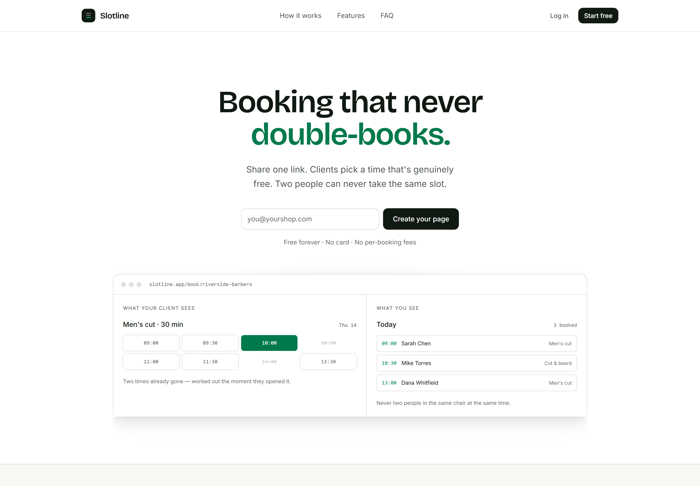
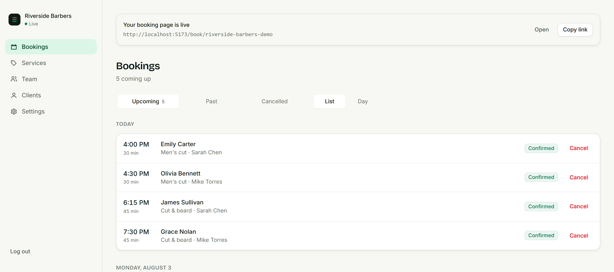
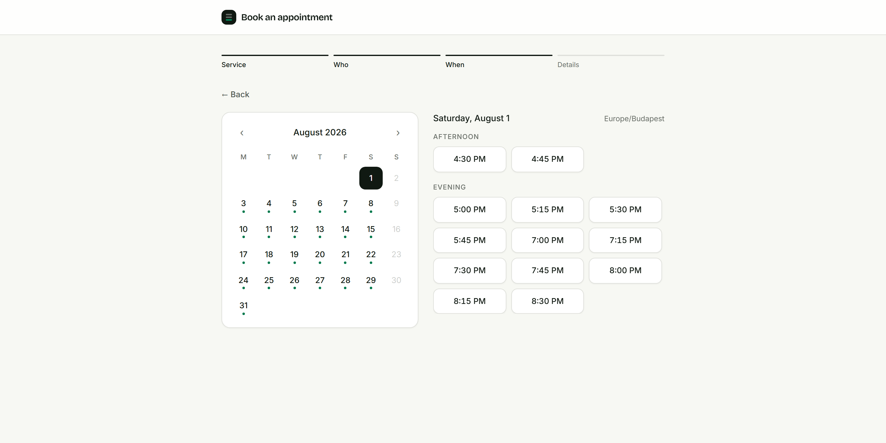

# Slotline

Appointment booking for small businesses. A public page where a client picks a
real, bookable time, and a dashboard where the business sees its week.

Two people can never take the same slot — not because a check usually catches
it, but because the database refuses to store the second one.

Runs entirely on free tiers. No payment processing anywhere in the product, and
no per-booking fee.



---

## What it does

The dashboard a business logs into — bookings grouped by day, with new ones
arriving live:



And what a client sees on the public link. Days with availability carry a dot;
times are grouped by part of day and shown in the client's own timezone:



### For the business

| | |
|---|---|
| **Guided setup** | A four-step checklist gets you from signup to a live booking page. It knows which of service, staff and hours is missing, and opens that form inline. |
| **Bookings** | Upcoming, past and cancelled. Read them as a list grouped by day, or as a day drawn to scale so a gap looks like a gap. New bookings appear live — no refresh. |
| **Close bookings out** | Mark who came in and who didn't. No-show counts show up on the client record. |
| **Services** | Name, duration, price, and a gap afterwards to reset between clients. Retire one without losing its history. |
| **Team** | Weekly hours per person with independent start and end times per day, plus time off for holidays and closures. Pause someone without deleting them. |
| **Clients** | Everyone who has booked, how often, when they last came, and how many times they didn't. |
| **Settings** | Business name, timezone, how much notice you need, and how far ahead people can book. |
| **Access** | Owner, admin and staff roles. Add colleagues by email. |
| **Google Calendar** | Two-way, per staff member. Existing events block the time; new bookings appear in your calendar. |
| **Several businesses** | One login, kept completely separate. |

### For their clients

| | |
|---|---|
| **No account** | Open the link, pick a time, leave a name and email. |
| **Held while they type** | The slot is reserved the moment they pick it, with a visible countdown. |
| **Their own timezone** | Times are shown in the client's zone, labelled, never silently converted. |
| **Manage it themselves** | Every confirmation carries a private link to that one appointment — cancel or move it without phoning. |
| **Reminders** | A day ahead, in their timezone, with the same link. |

---

## How it's built

### Stack

| Layer | Choice |
|---|---|
| Backend | NestJS 11 · TypeScript (strict, `exactOptionalPropertyTypes`) |
| Database | PostgreSQL — `btree_gist` for the overlap constraint, `citext` for case-insensitive uniqueness |
| ORM | Prisma 7, driver-adapter based |
| Jobs | A Postgres table with `FOR UPDATE SKIP LOCKED` and advisory locks. No Redis. |
| Frontend | React 19 · TypeScript · Vite · Tailwind v4 · react-router · TanStack Query · Motion |
| Email | Resend, or the server log when no key is set |
| Auth | Argon2id, JWT access tokens, rotating refresh tokens, Google OAuth |

`frontend/` and `backend/` are independent projects — separate dependencies,
separate tooling, separate `.env`. Neither reaches into the other.

### The five things that must always hold

**No two active bookings for one staff member overlap.**
This is enforced by the database itself, not by application code. Two requests
can both read "this slot is free" in the same instant and both try to save;
checking first cannot prevent that, because neither transaction can see the
other. So the rule lives in the schema: the database physically refuses to
store a second booking that overlaps an existing one for the same person, and
it only counts bookings that are still live, so cancelling frees the time
immediately. The request that loses gets a clean conflict response and a fresh
set of times rather than an error page. Tested with 200 simultaneous requests
for a single slot: exactly one succeeds, every time.

**Every booking resolves to one unambiguous instant.**
Every appointment is stored as an exact moment in universal time. Opening hours
are different: they are stored as the time on the wall plus the place it applies
to, and turned into a real moment day by day. That is why the clocks changing
shifts the underlying instant and leaves "we open at nine" exactly where it was.

**Data belongs to one organization and never leaks.**
A tenant guard resolves the organization from the URL and attaches the caller's
role; every repository call is scoped to it. Cross-tenant access returns 404,
not 403 — a different answer would confirm the resource exists.

**Every state change is attributable.**
One transition function per aggregate, with an audit row written in the same
transaction as the change.

**No notification sent twice, none silently lost.**
Messages are never sent from the booking path itself. The intent to send is
recorded alongside the booking, in the same operation, so it is exactly as
durable as the fact it describes, and a separate worker delivers it. Each
delivery is claimed before it is attempted, so retrying an already-sent message
does nothing — and a send that genuinely fails releases its claim, so the retry
picks it up instead of the message being quietly lost.

### Availability

Free times are computed on every request, never stored. A saved list goes stale
the moment anything changes; this one can't.

Start from the person's weekly hours for that day, then take away:

- any time off they have booked
- appointments and holds already on the books, plus the gap each service needs
  either side
- anything marked busy in their own Google Calendar
- anything sooner than the notice the business needs, or further out than it
  will accept

What is left is what a client is offered.

The engine that works this out touches no database and never reads the clock —
the current time is handed to it, which is what makes its behaviour
reproducible. Time ranges are handled so that one appointment ending exactly
where the next begins never counts as a clash. The tests run twice, once in UTC
and once in a timezone with aggressive daylight saving.

### Rescheduling

Moving an appointment creates the new one and retires the old one together, with
a link between them so the history stays followable rather than looking like an
unexplained cancellation sitting next to an unrelated booking. The new time goes
through the same overlap check as any other booking, so a slot someone else took
a second ago is refused — and because the old time is only given up as part of
the same operation, a move that fails cannot leave a client with no appointment
at all.

### Client self-service

Every booking carries a capability token: 32 random bytes, unique, and good for
exactly one appointment. It travels in the confirmation email, which is safe in
a way a session token would not be, because holding it grants nothing except
seeing, moving or cancelling that one booking. A wrong token and a deleted
booking return the same 404.

### Front end

The dashboard reads one aggregate endpoint rather than one request per resource,
and TanStack Query caches it — moving between pages costs no network at all.
Mutations write the server's own response into the cache instead of refetching.
A server-sent event stream pushes new bookings to every open dashboard, and
invalidates a single query key when one arrives.

The public booking funnel is loaded eagerly and everything else is code-split, so
a stranger on mobile data never downloads the dashboard or the animation library.

---

## Running it

You need Node 20+ and a PostgreSQL database.

```bash
# Backend
cd backend
npm install
cp .env.example .env          # fill in DATABASE_URL and JWT_SECRET
npx prisma migrate deploy
npx prisma generate
npm run dev                   # API on :3000
npm run dev:worker            # outbox + scheduled work

# Frontend
cd frontend
npm install
npm run dev                   # app on :5173
```

### Environment

| Variable | Required | Notes |
|---|---|---|
| `DATABASE_URL` | yes | PostgreSQL connection string |
| `JWT_SECRET` | yes | 32+ characters |
| `FRONTEND_URL` | | Defaults to `http://localhost:5173` |
| `RESEND_API_KEY` | | Without it, email is written to the log instead of sent |
| `EMAIL_FROM` | | Needs a domain you've verified with Resend |
| `GOOGLE_CLIENT_ID`, `GOOGLE_CLIENT_SECRET`, `ENCRYPTION_KEY` | | All three together, or none. Enables calendar sync and Google sign-in. `ENCRYPTION_KEY` is 32 bytes, base64. |

### Checks

There is no CI pipeline — run these locally before you push.

```bash
# Backend
cd backend
npm run lint
npm run format          # --check; use format:fix to rewrite
npm run typecheck
npm test
npm run build

# Frontend
cd frontend
npm run lint
npm run format
npm run typecheck
npm run build
```

The backend tests need a real database and will write to it, including a
concurrency test that fires 200 simultaneous requests at a single slot. Point
`DATABASE_URL` at something disposable, never at production. They run twice —
once in UTC and once in a timezone with aggressive daylight saving — so the
suite takes a couple of minutes.

`docker compose up -d postgres` gives you a throwaway database on port 5432 if
you'd rather not use a hosted one.

---

## Operating it

**Backups.** Managed Postgres (Neon, Supabase) keeps its own. Rehearse a restore
before you depend on one.

**Errors.** Unhandled errors are logged against the request's correlation id, and
that id comes back in the 500 response. When someone reports a problem, ask for
the id and grep for it.

**Live updates** are server-sent events held in process, which is right for a
single API instance. Running more than one means moving them to Postgres
`LISTEN`/`NOTIFY`.

**Rate limits** are 20 requests per 10s and 100 per minute globally, with
creating a booking held to 10 per minute — that endpoint writes, sends mail and
pushes to every open dashboard.
